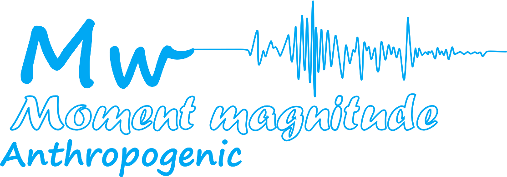

# Anthropogenic Mw

Earthquake moment magnitude estimation from P, S, or P and S waves together

Copyright (c) 2025, Jan Wiszniowski <jwisz@igf.edu.pl>

## Description

The Anthropogenic Mw package is designed for the determination of the moment magnitude (Mw)
of small and local earthquakes, where stations are close to hypocenters.
Such situations often occur in anthropogenic events, and this algorithm was developed to calculate Mw
of mining-induced and reservoir-triggered earthquakes. Hence, the package name is *Anthropogenic Mw*.
However, it can also be used for natural events and is recommended for local ones.

The method of Mw computation based on spectral displacement amplitude is elaborated.
Mw is computed using a fitting of displacement spectra of seismic waves recorded at stations
to the simulated spectrum in the far field with the estimation of the noise.
As proposed, it allows for estimating Mw based on a single P or S wave spectra.
However, a combined spectrum of two waves together and spectrum simulation in intermediate and near fields
was applied to Mw estimation as an innovation.
The algorithm automatically estimates the station magnitude of small and close events.

## Command line tools

>**For the impatient**
>
>To run the example, call (Windows)
>
>   *spectral_Mw -c example\STr2_test.xml example\STr2_config.json*
> 
>or
>
>   *spectral_Mw -c example\LUMINEOS_catalog_with_s_phases.xml example\LUMINEOS_config.json*
>
>The example catalog you can download from https://github.com/JanWiszniowski/amw/example

### Spectral Mw calculation

The spectral Mw is calculated by *spectral_Mw.py*. After installing Anthropogenic Mw,
you can get help on the command line arguments used by each code by typing from your terminal:

    spectral_Mw -h

The recommended use case is cooperation with the external server.
You must first prepare the *configuration.json* file and then run:

    spectral_Mw -q event.xml configuration.json,

where *event.xml* is an example of the catalog file name
and *configuration.json* is the configuration file name,
which contains all information required for program to work.
See two configuration examples in https://github.com/JanWiszniowski/amw/example.

### Source spectra visualization

Source spectra are plotted by *view_green_function*.
Call:

    view_green_fun configuration.json
	
where *configuration.json* is the configuration file.

## Documentation

The documentation is in the *anthropogenicmw.pdf* file.
